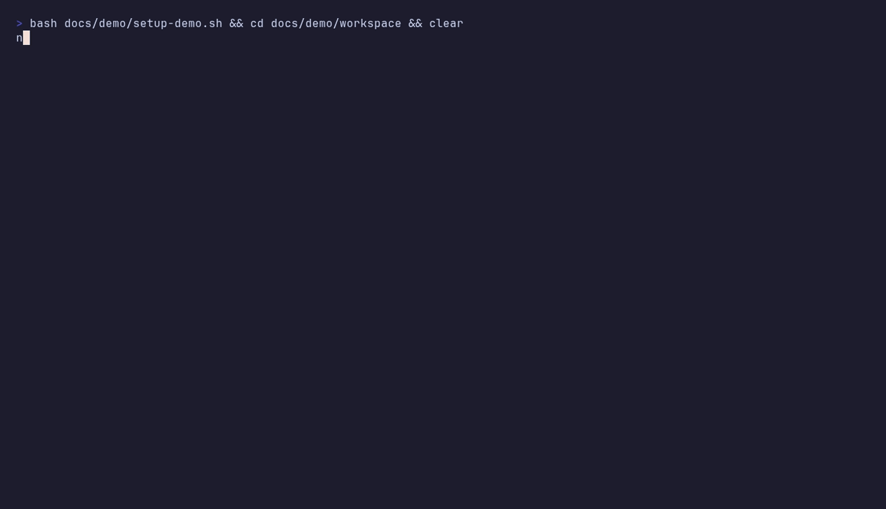

# Tracepad

Tracepad is a local-first debugging flight recorder.

It captures the parts of an investigation that usually vanish:

- shell history
- commands you ran
- findings, hypotheses, and decisions
- git status and diff snapshots
- copied logs and evidence
- a replayable timeline you can export as a handoff, PR brief, issue, or postmortem

Everything stays in the repo under `.tracepad`. No server. No daemon. No dependencies.

The adoption goal is simple: Tracepad should fit into the terminal, git, and review tools developers already use.

## Why it exists

Most debugging work is still a mix of shell scrollback, half-written notes, pasted stack traces, and vague memory. That creates:

- weak handoffs
- slow review cycles
- repeated investigations
- missing incident timelines
- poor reproduction notes

Tracepad turns that into structured session data.



## Quick start

From the `tracepad` folder:

```bash
node ./bin/tracepad.js init --repo /path/to/repo --hooks
node ./bin/tracepad.js alias setup --shell powershell
node ./bin/tracepad.js record "Auth refresh bug" --repo /path/to/repo --context "Fails after warm cache"
```

That flow will:

- create `.tracepad`
- install optional git hooks
- print shell integration for passive command capture
- start a session
- capture a baseline `git status` snapshot
- import recent shell history
- open compact capture mode

## Core workflow

Start a session:

```bash
node ./bin/tracepad.js start "NPE after token refresh" --repo /path/to/repo
```

Add notes:

```bash
node ./bin/tracepad.js note "Fails only when cache is warm" --repo /path/to/repo --kind finding
node ./bin/tracepad.js note "Token refresh race in adapter" --repo /path/to/repo --kind hypothesis
node ./bin/tracepad.js note "Guard refresh with single-flight" --repo /path/to/repo --kind decision
```

Record a command:

```bash
node ./bin/tracepad.js cmd "mvn test -Dtest=AuthFlowTest" --repo /path/to/repo --exit-code 1 --note "Refresh path still fails"
node ./bin/tracepad.js cmd "npm test" --repo /path/to/repo --source passive-shell --exit-code 1
```

Install passive shell capture:

```bash
node ./bin/tracepad.js alias setup --shell bash
node ./bin/tracepad.js alias setup --shell zsh
node ./bin/tracepad.js alias setup --shell powershell --install
```

The shell integration records terminal commands into the active Tracepad session after each prompt. It only runs inside repos with `.tracepad/state.json`, skips Tracepad commands to avoid recursive logging, and writes through a background process so prompts do not wait on Tracepad.

Attach evidence from disk or clipboard:

```bash
node ./bin/tracepad.js attach ./logs/auth.log --repo /path/to/repo --note "Stack trace from local run"
node ./bin/tracepad.js attach --repo /path/to/repo --clip --note "Copied error payload"
```

Capture code state:

```bash
node ./bin/tracepad.js diff --repo /path/to/repo --note "Working tree before refactor"
node ./bin/tracepad.js diff --repo /path/to/repo --staged --note "Ready-to-commit delta"
node ./bin/tracepad.js diff --repo /path/to/repo --commit HEAD --note "Committed fix snapshot"
```

Trim a large log down to the failure lines that matter:

```bash
node ./bin/tracepad.js parse ./server.log --repo /path/to/repo --context-lines 3 --max-matches 200 --note "Fatal excerpt"
```

`parse` streams the file line by line, so large logs do not need to fit in memory.

Replay the command trail:

```bash
node ./bin/tracepad.js replay --repo /path/to/repo --format markdown
node ./bin/tracepad.js replay --repo /path/to/repo --format shell --output ./repro.sh
```

Export the session:

```bash
node ./bin/tracepad.js export --repo /path/to/repo --template handoff --output ./handoff.md
node ./bin/tracepad.js export --repo /path/to/repo --template pr --output ./pr-brief.md
node ./bin/tracepad.js export --repo /path/to/repo --template issue --output ./issue.md
node ./bin/tracepad.js export --repo /path/to/repo --template postmortem --format html --output ./incident.html
node ./bin/tracepad.js export --repo /path/to/repo --format json --output ./session.json
node ./bin/tracepad.js export --repo /path/to/repo --template slack --output ./session-slack.json
node ./bin/tracepad.js export --repo /path/to/repo --exporter slack --output ./session-slack.json
```

Run a plugin importer:

```bash
node ./bin/tracepad.js import plain-log --repo /path/to/repo --file ./server.log --note "Failure excerpt"
```

Close the session:

```bash
node ./bin/tracepad.js close --repo /path/to/repo --summary "Root cause was duplicate refresh under warm cache"
```

## Commands

- `init [--hooks] [--no-gitignore]`
- `alias setup [--shell bash|zsh|powershell] [--install]`
- `start "title" [--context "..."]`
- `record "title" [--context "..."] [--history-limit 12] [--no-history] [--no-status-snapshot]`
- `use <session-id>`
- `branch-sync [--create-if-missing]`
- `list`
- `status [session-id]`
- `tui [session-id]`
- `note "text" [--kind note|finding|hypothesis|decision|blocker|context]`
- `cmd "command text" [--exit-code <n>] [--note "..."] [--source manual|passive-shell|history]`
- `history [--shell powershell|bash|zsh] [--file <history-path>] [--limit <n>]`
- `parse <log-file> [--context-lines 2] [--max-matches 200] [--note "..."]`
- `import <importer-name> [--file <path>] [--note "..."]`
- `replay [session-id] [--format shell|markdown] [--output <file>]`
- `diff [--staged] [--commit <ref>] [--note "..."]`
- `capture`
- `attach <file-path> [--note "..."] [--clip]`
- `export [session-id] [--format markdown|html|json] [--template handoff|issue|pr|postmortem|slack] [--exporter <name>] [--output <file>]`
- `close [summary text] [--summary "..."]`

## Git hook automation

`tracepad init --hooks` installs lightweight automation into the repo's local git hooks:

- `post-commit` captures `git show HEAD` into the active session
- `post-checkout` switches the active session to the current branch, or creates one when needed

This keeps Tracepad close to the actual debugging loop without a background process.

`tracepad init` also updates `.gitignore` by default:

- `.tracepad/state.json`
- `.tracepad/exports/`
- `.tracepad/artifacts/`

Session JSON files are intentionally not ignored. Teams can choose whether investigation history belongs in their repo.

## Plugin surface

Built-in plugins live under:

- `src/plugins/importers`
- `src/plugins/exporters`

Repo-local/private plugins can live under:

- `.tracepad/plugins/importers`
- `.tracepad/plugins/exporters`

Examples included today:

- `plain-log` importer: extracts high-signal error lines from a text log
- `slack` exporter: produces Slack Block Kit JSON

Plugin contracts are documented in `src/plugins/README.md` and `CONTRIBUTING.md`.

## TUI

Open the terminal dashboard with:

```bash
node ./bin/tracepad.js tui --repo /path/to/repo
```

Hotkeys:

- `q`: quit
- `r`: refresh
- `e`: export HTML handoff
- `d`: capture a git diff snapshot
- `n`: add a quick note
- `[ ]`: select the timeline event to inspect
- `j k`: scroll the preview pane

## Output model

Tracepad stores:

- `.tracepad/state.json`
- `.tracepad/sessions/<session-id>.json`
- `.tracepad/artifacts/<session-id>/...`
- `.tracepad/exports/...`
- `schema/session.schema.json` describes the public session format

That makes sessions easy to inspect, version, or build tooling around later.

## HTML diff reports

HTML exports inline captured git patches as a colorized diff viewer. The report is still a single static file, so it can be shared in handoffs without a Tracepad server.

## Safety

Tracepad applies lightweight redaction before saving or exporting text. It scrubs common secret patterns such as:

- AWS access keys
- bearer tokens
- JWT-like tokens
- private key blocks
- common `password=` or `token=` style assignments

This is intentionally simple and should be treated as a safety net, not a compliance boundary.

## Timeline format

Exports and status views use relative timestamps so a session reads like an investigation trace:

```text
[+00:00:00] CONTEXT | Fails after warm cache
[+00:04:12] FINDING | Repro only happens on second refresh
[+00:07:35] CMD | mvn test -Dtest=AuthFlowTest | exit 1
[+00:11:22] SNAPSHOT | git-diff | .tracepad/artifacts/...
```

## Open-source fit

Tracepad is useful for:

- open-source maintainers debugging community bug reports
- Node and Java engineers preserving repro steps
- DevOps engineers documenting incident triage
- reviewers who need a clear path from hypothesis to fix

The free local-first core is enough for day-to-day use. Shared history, hosted archives, and team search can sit on top later without weakening the OSS base.
